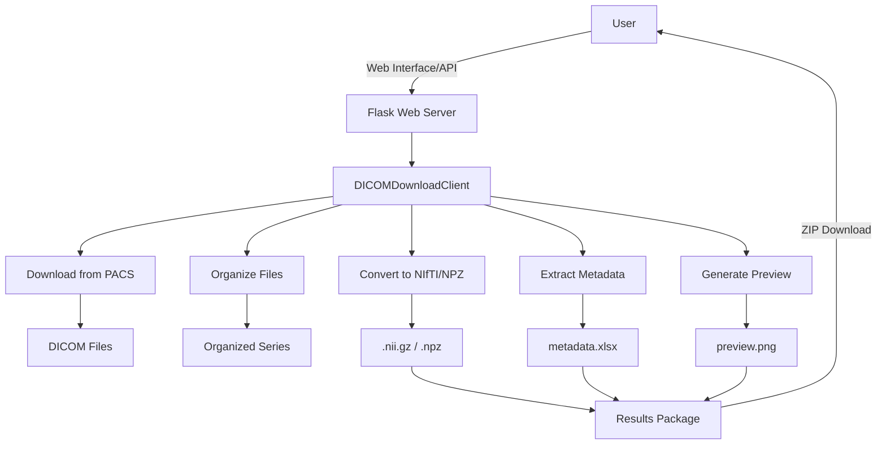

# DICOM Download & Processing Client

[中文说明请见 README_CN.md](README_CN.md)

A unified client for downloading DICOM files from PACS servers and processing them. This tool provides a web interface for managing downloads, extracting metadata, and converting images.

## Features

- **Direct PACS Integration**: Communicate directly with PACS servers using DICOM protocols (C-FIND, C-MOVE).
- **Metadata Extraction**: Extract DICOM tags to Excel files. Supports customizable templates for different modalities (MR, CT, DX, MG).
- **MR Metadata Normalization (MR_clean)**: When MR series are present, the exported Excel will include an additional sheet `MR_Cleaned` with standardized features (e.g. `sequenceClass`, `standardOrientation`, `isFatSuppressed`, `dynamicGroup`, `dynamicPhase`).
- **Image Conversion**: Convert DICOM series to NIfTI format.
- **Web Interface**: User-friendly web UI for searching patients and managing tasks.
- **Modality Support**: Specialized metadata extraction for MRI, CT, Digital Radiography (DX/DR), and Mammography (MG).
- **Derived Series Filtering**: Automatically filter out MPR, MIP, 3D VR, and other derived/reconstructed series (enabled by default).
- **Smart Filtering**: Configurable filters for modality, minimum series file count (default: 10 for 3D volumes), and derived series exclusion.

## Installation

1. Clone the repository.
2. Install dependencies:
   ```bash
   pip install -r requirements.txt
   ```

## Configuration

### PACS Connection
Create a `.env` file in the root directory with your PACS server details:

```ini
# DICOM Server Configuration
PACS_IP=127.0.0.1
PACS_PORT=1024
CALLING_AET=cllient
CALLED_AET=pacsServer
CALLING_PORT=1023
```

### Metadata Templates
You can customize the DICOM tags extracted for each modality by editing the JSON files in the `dicom_tags/` directory:
- `mr.json`: MRI
- `ct.json`: CT
- `dx.json`: Digital Radiography (DR/DX/CR)
- `mg.json`: Mammography

Note for MRI normalization:
- `mr.json` must include `ImageType` (used by `MR_clean.py` for refined image type and subtype detection).

### MR_clean Rules Configuration
MRI normalization rules (keywords/thresholds/regex) are externalized in `mr_clean_config.json`.

- Default behavior: `MR_clean.process_mri_dataframe(df)` loads `mr_clean_config.json` automatically.
- Advanced usage: pass a config dict via `cfg=...` or override path via `config_path=...`.
- Typical edits:
   - `thresholds.field_strength.*`: TR/TE/TI thresholds by field strength
   - `classification.ruleA`: name-based special sequence recognition
   - `classification.sequence_family`: GRE/SE/TSE family heuristics
   - `dynamic.*`: dynamic grouping / contrast heuristics

### Quality Control (QC) Threshold Configuration
The QC system supports modality-specific configurable thresholds via the `.env` file.

**Example Configuration** (in `.env` file):
```ini
# Dynamic range minimum threshold
QC_DEFAULT_DYNAMIC_RANGE_MIN=20
QC_CT_DYNAMIC_RANGE_MIN=20
QC_MR_DYNAMIC_RANGE_MIN=15
QC_DX_DYNAMIC_RANGE_MIN=10
QC_DR_DYNAMIC_RANGE_MIN=10
QC_MG_DYNAMIC_RANGE_MIN=10
QC_CR_DYNAMIC_RANGE_MIN=10

# Standard deviation minimum threshold (contrast)
QC_DEFAULT_STD_MIN=5
QC_CT_STD_MIN=5
QC_MR_STD_MIN=5
QC_DX_STD_MIN=3
QC_DR_STD_MIN=3
QC_MG_STD_MIN=3
QC_CR_STD_MIN=3

# Unique pixel value ratio minimum threshold (complexity)
# X-ray images (DX/DR/MG/CR) typically have lower unique ratios than CT/MR
QC_DEFAULT_UNIQUE_RATIO_MIN=0.01
QC_CT_UNIQUE_RATIO_MIN=0.01
QC_MR_UNIQUE_RATIO_MIN=0.008
QC_DX_UNIQUE_RATIO_MIN=0.001
QC_DR_UNIQUE_RATIO_MIN=0.001
QC_MG_UNIQUE_RATIO_MIN=0.001
QC_CR_UNIQUE_RATIO_MIN=0.001

# Exposure detection thresholds
QC_DEFAULT_LOW_RATIO_THRESHOLD=0.6
QC_DEFAULT_HIGH_RATIO_THRESHOLD=0.6

# Series low quality threshold (mark series as low quality if > this ratio of images are low quality)
QC_DEFAULT_SERIES_LOW_QUALITY_RATIO=0.3
```

**Default Thresholds by Modality**:

| Modality | unique_ratio_min | std_min | dynamic_range_min |
|----------|------------------|---------|-------------------|
| CT       | 0.01 (strict)    | 5       | 20                |
| MR       | 0.008 (moderate) | 5       | 15                |
| DX       | 0.001 (lenient)  | 3       | 10                |
| DR       | 0.001 (lenient)  | 3       | 10                |
| MG       | 0.001 (lenient)  | 3       | 10                |
| CR       | 0.001 (lenient)  | 3       | 10                |

Note: X-ray images (DX/DR/MG/CR) typically have simpler content, so they use more lenient complexity thresholds.

## Usage

### Web Interface

1. Start the web application:
   ```bash
   python -m src.web.app
   ```
2. Open your browser and navigate to `http://localhost:5005`.
3. Use the interface to search for patients and start download/processing tasks.

**Filter Options (Web Interface):**
- **Modality Filter**: Filter by modality (e.g., `MR`, `CT`, or comma-separated like `MR,CT`)
- **Min Series Files**: Skip series with fewer files than this threshold (default: 10 for 3D volumes like CT/MR)
- **Exclude Derived Series**: Automatically filter out MPR, MIP, VR, and other reconstructed series (enabled by default)

### Command Line Interface (CLI)

For batch processing, use the CLI tool:

```bash
# Basic usage (with default filters: exclude derived, min_files=10)
python src/cli/download.py M25053000056

# Specify output format
python src/cli/download.py M25053000056 --format npz

# Filter by modality
python src/cli/download.py M25053000056 --modality MR

# Include derived series (MPR, MIP, VR, etc.)
python src/cli/download.py M25053000056 --include_derived

# Adjust minimum file threshold
python src/cli/download.py M25053000056 --min_files 20

# Full example with all options
python src/cli/download.py M25053000056 \
    --output_dir ./downloads \
    --format nifti \
    --modality CT \
    --min_files 15
```

**CLI Arguments:**
| Argument | Description | Default |
|----------|-------------|---------|
| `accession` | AccessionNumber to download | (required) |
| `--output_dir` | Download result directory | `./downloads` |
| `--format` | Output format (`nifti` or `npz`) | `nifti` |
| `--modality` | Modality filter (e.g., `MR`, `CT`, comma-separated) | None |
| `--min_files` | Minimum series file count threshold | `10` |
| `--include_derived` | Include derived series (MPR, MIP, VR, etc.) | False |

### Output
- The metadata Excel contains at least `DICOM_Metadata` and `Series_Summary` sheets.
- If MR records are present, an additional `MR_Cleaned` sheet is generated.
- `download.py` is recommended for large tasks 

## Project Structure

### New Source Layout (Refactored)

The codebase has been reorganized into a `src/` directory structure for better maintainability:

```
src/
├── __init__.py              # Package initialization
├── models.py                # Data models (ClientConfig, SeriesInfo, WorkflowResult)
├── core/                    # Core DICOM processing modules
│   ├── organize.py          # DICOM file organization
│   ├── convert.py           # DICOM to NIfTI/NPZ conversion
│   ├── metadata.py          # Metadata extraction
│   ├── qc.py                # Quality control
│   ├── preview.py           # Preview image generation
│   └── mr_clean.py          # MR data cleaning and classification
├── client/                  # DICOM client modules
│   └── unified.py           # DICOMDownloadClient (main entry)
├── web/                     # Web application
│   └── app.py               # Flask web application
├── cli/                     # Command-line tools
│   └── download.py          # CLI download client
└── utils/                   # Utility modules
    └── packaging.py         # Result packaging (ZIP)
```

### Backward Compatibility

The original files in the root directory are kept as compatibility wrappers. They will import from the new `src/` locations and emit a `DeprecationWarning`. 

**Note**: While existing code importing from the root directory will continue to work, it is recommended to update imports to use the new `src.*` paths:

```python
# Old (deprecated)
from src.client.unified import DICOMDownloadClient

# New (recommended)
from src.client.unified import DICOMDownloadClient
```

### Legacy Project Structure (Root Directory)

- `app.py`: Compatibility wrapper for Flask web application.
- `dicom_client_unified.py`: Compatibility wrapper for core DICOM handling.
- `MR_clean.py`: Compatibility wrapper for MR metadata normalization.
- `test.py`: Upload workflow test runner.
- `dicom_tags/`: Configuration files for metadata extraction.
- `templates/`: HTML templates for the web UI.
- `static/`: Static assets (CSS, JS).
- `uploads/`: Directory for uploaded files.
- `results/`: Directory for processed results.

## Output formats (NIfTI / NPZ)

This project now supports exporting image data as either NIfTI (`.nii` / `.nii.gz`) or a normalized NPZ (`.npz`) file.

- Front-end: there is an "Output Format" option in the Process Options panel where you can choose `NIfTI` (default) or `NPZ`.
- Programmatic / CLI: when calling the processing workflow from Python, pass the `output_format` parameter to `process_complete_workflow`:

```python
from src.client.unified import DICOMDownloadClient

client = DICOMDownloadClient()
client.process_complete_workflow(
      accession_number='M25053000056',
      base_output_dir='./dicom_processed',
      output_format='npz'  # 'nifti' or 'npz'
)
```

- NPZ format details:
   - The tool generates a compressed `.npz` file containing a single array named `data` (dtype: float32).
   - The saved array shape is `[Z, Y, X]` where Z=depth (slices), Y=height (rows), X=width (cols). The file is normalized to a consistent patient-oriented coordinate system (based on DICOM ImageOrientationPatient / ImagePositionPatient):
      - Z axis is ordered from head -> foot (Superior → Inferior).
      - In-plane orientation is normalized to clinical axial (supine) view so that an extracted slice `arr[z]` is ready for display with common Python imaging tools.
   - If your downstream pipeline expects a different layout (for example `[Z, X, Y]`), you can transpose the saved array easily after loading:

```python
import numpy as np

arr = np.load('series.npz')['data']  # arr.shape == (Z, Y, X)
arr_zxy = np.transpose(arr, (0, 2, 1))  # now shape == (Z, X, Y)
```

Notes:
   - NPZ generation uses a temporary NIfTI intermediate (dcm2niix or Python libs) to obtain robust orientation information from DICOM tags.
   - The `.npz` files are compressed with `np.savez_compressed` and use float32 to balance precision and size.

Recent improvements (2026-03-18):

- **Derived Series Filtering**:
   - Automatically filter out MPR, MIP, 3D VR, and other derived/reconstructed series.
   - Checks both `ImageType` (DERIVED/SECONDARY) and `SeriesDescription` keywords.
   - Enabled by default in both Web UI and CLI (use `--include_derived` to disable in CLI).
   - Configurable minimum series file count (default: 10 for 3D volumes like CT/MR).

Recent improvements (2026-02-08):

- **Modality-specific Configurable QC Thresholds**:
   - The QC system now supports different thresholds per modality (CT/MR/DX/DR/MG/CR).
   - Thresholds can be customized via the `.env` file without code changes.
   - X-ray images (DX/DR/MG/CR) use more lenient complexity thresholds (unique_ratio_min=0.001), while CT/MR use stricter standards (CT: 0.01, MR: 0.008).

- **QC Reason Descriptions**:
   - The `metadata.xlsx` now includes a `Low_quality_reason` column with English descriptions of quality issues.
   - Supported reasons include: `Low dynamic range`, `Low contrast`, `Low complexity`, `Under-exposed`, `Over-exposed`, `Potential inverted border`, etc.
   - Normal quality images are marked as `Normal`.

- **Filename Format Improvement**:
   - The `FileName` column in `metadata.xlsx` now uses the format `AccessionNumber/filename` (e.g., `M22042704067/SHWMS13A_0001.nii.gz`).
   - This facilitates matching low-quality labels with final output images.

Earlier improvements (2026-01-17):

- Quality control during conversion:
   - The tool now runs a lightweight QC (`_assess_image_quality`) on images during NPZ conversion. It detects low dynamic range, low contrast, grayscale inversion (MONOCHROME1-like), and exposure anomalies (under/over-exposed) and marks problematic images.
   - For series (CT/MR) a sequence-level QC (`_assess_series_quality`) aggregates per-slice results. Behavior:
      - If slice_count <= 200: full per-slice QC.
      - If slice_count > 200: sampling QC using middle ±3 slices (7 samples).
   - NPZ conversion returns QC metadata in its result dict: `low_quality`, `low_quality_ratio`, `qc_mode`, and `qc_sample_indices`.

- Photometric & rescale handling:
   - DICOM `RescaleSlope/RescaleIntercept` are applied before saving.
   - `PhotometricInterpretation` MONOCHROME1 images are auto-inverted to match display expectation (consistent with MONOCHROME2).

These changes improve robustness for downstream pipelines and provide early detection of problematic series.

---

## Web Interface

The system provides a user-friendly web interface for managing DICOM processing tasks:


**Features:**
- **Single Process**: Process individual studies by Accession Number
- **Batch Process**: Process multiple studies simultaneously
- **File Upload**: Upload and process DICOM ZIP files
- **Task List**: View history and download completed tasks
- **Real-time Progress**: Live progress tracking with step-by-step status
- **Process Options**: Configurable extraction, organization, and output format settings
- **PACS Configuration**: Direct configuration of DICOM server settings
- **Smart Filtering**:
  - Modality filter (e.g., `MR`, `CT`, or `MR,CT`)
  - Minimum series file count (default: 10 for 3D volumes)
  - Exclude derived series (MPR, MIP, VR, etc.) - enabled by default

---

## Architecture & Workflow

### System Architecture



### Preview Generation Workflow

The preview generation system uses a sophisticated orientation-aware algorithm to ensure correct image display:

```mermaid
flowchart TD
    A[Start: Generate Preview] --> B{File Format}
    B -->|.npz| C[Load NPZ Data]
    B -->|.nii| D[Load NIfTI Data]
    
    C --> E[Extract X-Z Slice]
    D --> E
    
    E --> F[Transpose: X→Horizontal, Z→Vertical]
    
    F --> G[Get DICOM Orientation]
    G --> H{Orientation Type}
    
    H -->|COR| I[Calc Aspect Ratio:<br/>slice_spacing / pixel_spacing[X]]
    H -->|SAG| J[Calc Aspect Ratio:<br/>slice_spacing / pixel_spacing[Y]]
    H -->|AX| K[Calc Aspect Ratio:<br/>slice_spacing / pixel_spacing[Y]]
    
    I --> L[Apply Aspect Ratio]
    J --> L
    K --> L
    
    L --> M[Apply Windowing]
    M --> N[Save Preview Image]
    N --> O[End]
```

### Orientation Detection Logic

The system uses DICOM `ImageOrientationPatient` (IOP) to detect scan orientation:

```mermaid
flowchart TD
    A[Read IOP from DICOM] --> B[Calculate Normal Vector:<br/>cross(row_vec, col_vec)]
    B --> C{Check Oblique}
    C -->|abs(max)² < 0.9 × sum²| D[Return: OBL]
    C -->|No| E[Find Dominant Axis]
    
    E -->|X dominant| F[Return: SAG]
    E -->|Y dominant| G[Return: COR]
    E -->|Z dominant| H[Return: AX]
    
    F --> I[Apply Orientation-Specific<br/>Aspect Ratio Calculation]
    G --> I
    H --> I
    D --> I
```

### Key Features of Preview Generation

1. **Format-Unified Processing**: Both `.npz` and `.nii` files are processed identically after loading
2. **Orientation-Aware Aspect Ratio**: 
   - **COR (Coronal)**: X-Z plane → aspect = slice_spacing / pixel_spacing[0]
   - **SAG (Sagittal)**: Y-Z plane → aspect = slice_spacing / pixel_spacing[1]  
   - **AX (Axial)**: X-Y plane → aspect = slice_spacing / pixel_spacing[1]
3. **Automatic Transpose Correction**: Detects and corrects row/column mismatches based on DICOM metadata
4. **Windowing Support**: Applies DICOM window center/width for proper contrast
