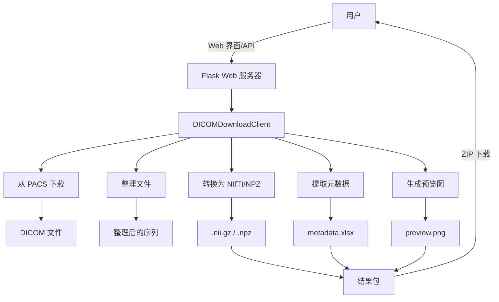

# DICOM 下载与处理客户端

这是一个统一的 DICOM 文件下载和处理工具，可以直接从 PACS 服务器下载数据，并进行元数据提取和格式转换。

## 功能特点

- **PACS 直接集成**: 使用 DICOM 协议 (C-FIND, C-MOVE) 直接与 PACS 服务器通信。
- **元数据提取**: 将 DICOM 标签提取到 Excel 文件中。支持不同模态（MR, CT, DX, MG）的自定义模板。
- **MR 元数据治理（MR_clean）**: 当存在 MR 序列时，导出的 Excel 会额外生成 `MR_Cleaned` 工作表，包含标准化的特征与分类结果（如 `sequenceClass`、`standardOrientation`、`isFatSuppressed`、`dynamicGroup`、`dynamicPhase` 等）。
- **图像转换**: 将 DICOM 序列转换为 NIfTI 格式。
- **Web 界面**: 提供友好的 Web 界面用于查询患者和管理任务。
- **多模态支持**: 针对 MRI、CT、数字X光 (DX/DR) 和乳腺钼靶 (MG) 提供专门的元数据提取支持。
- **衍生序列过滤**: 自动过滤 MPR、MIP、3D VR 等人工重建序列（默认启用）。
- **智能过滤**: 支持按模态、最小序列文件数（3D体积默认为10）和衍生序列排除进行配置过滤。

## 安装说明

1. 克隆项目代码。
2. 安装依赖包：
   ```bash
   pip install -r requirements.txt
   ```

## 配置说明

### PACS 连接配置
在项目根目录下创建 `.env` 文件，并填入 PACS 服务器信息：

```ini
# DICOM Server Configuration
PACS_IP=172.17.250.192
PACS_PORT=2104
CALLING_AET=WMX01
CALLED_AET=pacsFIR
CALLING_PORT=1103
```

### 元数据模板配置
您可以通过编辑 `dicom_tags/` 目录下的 JSON 文件来自定义不同模态提取的 DICOM 标签：
- `mr.json`: 磁共振 (MRI)
- `ct.json`: CT
- `dx.json`: 数字X光 (DR/DX/CR)
- `mg.json`: 乳腺钼靶 (Mammography)

MRI 治理相关说明：
- `mr.json` 需要包含 `ImageType` 字段（`MR_clean.py` 用它做 refined image type / subtype 识别）。

### MR_clean 规则配置
MRI 治理的规则（关键词/阈值/正则等）已抽离到 `mr_clean_config.json`，便于后续直接改配置而不改代码。

- 默认行为：`MR_clean.process_mri_dataframe(df)` 会自动加载 `mr_clean_config.json`。
- 高级用法：可通过 `cfg=...` 直接传入配置字典，或通过 `config_path=...` 指定自定义配置文件路径。
- 常见可调项：
   - `thresholds.field_strength.*`：不同磁场强度的 TR/TE/TI 阈值
   - `classification.ruleA`：名称优先的特殊序列识别
   - `classification.sequence_family`：GRE/SE/TSE 家族判断规则
   - `dynamic.*`：动态增强分组与增强判定规则

### 质量控制 (QC) 阈值配置
质控系统支持基于模态（Modality）的可配置阈值，通过 `.env` 文件自定义各模态的质控标准。

**默认配置示例**（`.env` 文件）：
```ini
# 动态范围最小阈值
QC_DEFAULT_DYNAMIC_RANGE_MIN=20
QC_CT_DYNAMIC_RANGE_MIN=20
QC_MR_DYNAMIC_RANGE_MIN=15
QC_DX_DYNAMIC_RANGE_MIN=10
QC_DR_DYNAMIC_RANGE_MIN=10
QC_MG_DYNAMIC_RANGE_MIN=10
QC_CR_DYNAMIC_RANGE_MIN=10

# 标准差最小阈值（对比度）
QC_DEFAULT_STD_MIN=5
QC_CT_STD_MIN=5
QC_MR_STD_MIN=5
QC_DX_STD_MIN=3
QC_DR_STD_MIN=3
QC_MG_STD_MIN=3
QC_CR_STD_MIN=3

# 唯一值比例最小阈值（复杂度）
# X-ray图像（DX/DR/MG/CR）通常比CT/MR具有更低的唯一值比例
QC_DEFAULT_UNIQUE_RATIO_MIN=0.01
QC_CT_UNIQUE_RATIO_MIN=0.01
QC_MR_UNIQUE_RATIO_MIN=0.008
QC_DX_UNIQUE_RATIO_MIN=0.001
QC_DR_UNIQUE_RATIO_MIN=0.001
QC_MG_UNIQUE_RATIO_MIN=0.001
QC_CR_UNIQUE_RATIO_MIN=0.001

# 曝光检测阈值
QC_DEFAULT_LOW_RATIO_THRESHOLD=0.6
QC_DEFAULT_HIGH_RATIO_THRESHOLD=0.6

# 系列低质量阈值（超过此比例的图像为低质量则标记整个系列为低质量）
QC_DEFAULT_SERIES_LOW_QUALITY_RATIO=0.3
```

**不同模态的默认阈值**：

| 模态 | unique_ratio_min | std_min | dynamic_range_min |
|-----|-----------------|---------|-------------------|
| CT  | 0.01 (严格)      | 5       | 20                |
| MR  | 0.008 (适中)     | 5       | 15                |
| DX  | 0.001 (宽松)     | 3       | 10                |
| DR  | 0.001 (宽松)     | 3       | 10                |
| MG  | 0.001 (宽松)     | 3       | 10                |
| CR  | 0.001 (宽松)     | 3       | 10                |

说明：X-ray 类图像（DX/DR/MG/CR）通常具有更简单的图像内容，因此使用更宽松的复杂度阈值。

## 使用方法

### Web 界面

1. 启动 Web 应用：
   ```bash
   python -m src.web.app
   ```
2. 打开浏览器访问 `http://localhost:5005`。
3. 使用界面查询患者并开始下载/处理任务。

**过滤选项（Web 界面）：**
- **模态过滤**：按模态筛选（如 `MR`、`CT`，或逗号分隔的 `MR,CT`）
- **最小序列文件数**：跳过文件数少于此阈值的序列（3D体积如CT/MR默认：10）
- **排除衍生序列**：自动过滤 MPR、MIP、VR 等重建序列（默认启用）

### 命令行工具 (CLI)

对于批量处理，请使用 CLI 工具：

```bash
# 基本用法（使用默认过滤器：排除衍生序列，最小文件数=10）
python src/cli/download.py M25053000056

# 指定输出格式
python src/cli/download.py M25053000056 --format npz

# 按模态过滤
python src/cli/download.py M25053000056 --modality MR

# 包含衍生序列（MPR、MIP、VR 等）
python src/cli/download.py M25053000056 --include_derived

# 调整最小文件阈值
python src/cli/download.py M25053000056 --min_files 20

# 完整示例（所有选项）
python src/cli/download.py M25053000056 \
    --output_dir ./downloads \
    --format nifti \
    --modality CT \
    --min_files 15
```

**CLI 参数说明：**
| 参数 | 说明 | 默认值 |
|------|------|--------|
| `accession` | 要下载的 AccessionNumber | （必填） |
| `--output_dir` | 下载结果存放目录 | `./downloads` |
| `--format` | 输出格式（`nifti` 或 `npz`） | `nifti` |
| `--modality` | 模态过滤（如 `MR`、`CT`，逗号分隔） | 无 |
| `--min_files` | 最小序列文件数阈值 | `10` |
| `--include_derived` | 包含衍生序列（MPR、MIP、VR 等） | 否 |

### 输出说明
- 元数据 Excel 至少包含 `DICOM_Metadata` 与 `Series_Summary` 两个工作表。
- 当存在 MR 记录时，会额外生成 `MR_Cleaned` 工作表。
- 大量任务建议使用 download.py 执行

## 项目结构

### 新的源码布局（已重构）

代码库已重新组织为 `src/` 目录结构，以提高可维护性：

```
src/
├── __init__.py              # 包初始化
├── models.py                # 数据模型 (ClientConfig, SeriesInfo, WorkflowResult)
├── core/                    # 核心 DICOM 处理模块
│   ├── organize.py          # DICOM 文件组织
│   ├── convert.py           # DICOM 转 NIfTI/NPZ 转换
│   ├── metadata.py          # 元数据提取
│   ├── qc.py                # 质量控制
│   ├── preview.py           # 预览图生成
│   └── mr_clean.py          # MR 数据清洗和分类
├── client/                  # DICOM 客户端模块
│   └── unified.py           # DICOMDownloadClient（主入口）
├── web/                     # Web 应用程序
│   └── app.py               # Flask Web 应用
├── cli/                     # 命令行工具
│   └── download.py          # CLI 下载客户端
└── utils/                   # 工具模块
    └── packaging.py         # 结果打包 (ZIP)
```

### 向后兼容性


**注意**：建议更新导入语句以使用新的 `src.*` 路径：

```python


from src.client.unified import DICOMDownloadClient
```

### 传统项目结构（根目录）

- `app.py`: Flask Web 应用的兼容性包装器。
- `dicom_client_unified.py`: 核心 DICOM 处理的兼容性包装器。
- `MR_clean.py`: MR 元数据治理的兼容性包装器。
- `test.py`: 上传工作流测试运行器。
- `dicom_tags/`: 元数据提取配置文件目录。
- `templates/`: Web 界面 HTML 模板。
- `static/`: 静态资源 (CSS, JS)。
- `uploads/`: 上传文件目录。
- `results/`: 处理结果目录。

## 输出格式（NIfTI / NPZ）

本项目现在支持将图像输出为 NIfTI（`.nii` / `.nii.gz`）或规范化的 NPZ（`.npz`）格式。

- 前端：在界面右侧的“处理选项”中新增了“输出格式”选项，可选择 `NIfTI`（默认）或 `NPZ`。
- 编程/脚本调用：在 Python 中调用处理流程时，可通过 `output_format` 参数控制输出：

```python
from src.client.unified import DICOMDownloadClient

client = DICOMDownloadClient()
client.process_complete_workflow(
      accession_number='M25053000056',
      base_output_dir='./dicom_processed',
      output_format='npz'  # 'nifti' 或 'npz'
)
```

- NPZ 格式说明：
   - 生成的 `.npz` 文件包含单个数组 `data`（dtype: float32）。
   - 保存数组的形状为 `[Z, Y, X]`，其中 Z=层数（切片），Y=高度（行），X=宽度（列）。该数据已根据 DICOM 的 `ImageOrientationPatient` / `ImagePositionPatient` 做过方向规范化：
      - Z 轴顺序为从头到脚（Superior → Inferior）。
      - 平面内方向已规范为临床常用的轴位（仰卧位），使得直接显示 `arr[z]` 时能得到期望的观察角度。
   - 若下游处理需要不同的布局（例如 `[Z, X, Y]`），可在加载后简单转置：

```python
import numpy as np

arr = np.load('series.npz')['data']  # arr.shape == (Z, Y, X)
arr_zxy = np.transpose(arr, (0, 2, 1))  # 现在 shape == (Z, X, Y)
```

注意：
   - NPZ 生成会先用 dcm2niix（若可用）或 Python 库生成 NIfTI 中间文件以获取可靠的方向信息。
   - `.npz` 使用 `np.savez_compressed` 压缩并以 float32 存储，以平衡精度与文件大小。

近期改进（2026-03-18）：

- **衍生序列过滤**：
   - 自动过滤 MPR、MIP、3D VR 等人工重建/衍生序列。
   - 同时检查 `ImageType`（DERIVED/SECONDARY）和 `SeriesDescription` 关键词。
   - Web 界面和 CLI 默认启用（CLI 使用 `--include_derived` 可禁用）。
   - 可配置最小序列文件数（3D体积如 CT/MR 默认：10）。

近期改进（2026-02-08）：

- **基于模态的可配置质控阈值**：
   - 质控系统现在支持按模态（CT/MR/DX/DR/MG/CR）设置不同的阈值。
   - 阈值可通过 `.env` 文件自定义，无需修改代码。
   - X-ray 类图像（DX/DR/MG/CR）使用更宽松的复杂度阈值（unique_ratio_min=0.001），而 CT/MR 使用更严格的标准（CT: 0.01, MR: 0.008）。

- **质控原因说明**：
   - `metadata.xlsx` 新增 `Low_quality_reason` 列，以英文描述低质量原因。
   - 支持的原因包括：`Low dynamic range`、`Low contrast`、`Low complexity`、`Under-exposed`、`Over-exposed`、`Potential inverted border` 等。
   - 正常质量图像显示为 `Normal`。

- **文件名格式改进**：
   - `metadata.xlsx` 中的 `FileName` 列现在格式为 `AccessionNumber/filename`（例如：`M22042704067/SHWMS13A_0001.nii.gz`）。
   - 这便于将低质量标签与最终输出图像匹配。

早期改进（2026-01-17）：

- 转换过程中的质量检测：
   - 在 NPZ 转换流程中新增了轻量级图像 QC（`_assess_image_quality`），用于检测低动态范围、低对比度、灰度反转（MONOCHROME1）和曝光异常（过暗/过亮），并对异常图像标记。
   - 对于序列（CT/MR）新增序列级 QC 聚合函数（`_assess_series_quality`）：
      - 当切片数 <= 200 时，对每张切片做全量 QC。
      - 当切片数 > 200 时，采用中间 ±3 张（共 7 张）抽样做 QC。
   - NPZ 转换的返回值中会包含 QC 元数据：`low_quality`、`low_quality_ratio`、`qc_mode`、`qc_sample_indices`。

- Photometric 与 Rescale 处理：
   - 在保存前应用 DICOM 的 `RescaleSlope/RescaleIntercept`。
   - 对 `PhotometricInterpretation` 为 `MONOCHROME1` 的图像自动反转，使输出与常见显示（MONOCHROME2）一致。

上述改进提高了对下游流程的鲁棒性，并可在早期检测出可疑序列以便人工复查。

---

## Web 界面

系统提供友好的 Web 界面用于管理 DICOM 处理任务：


**功能特点：**
- **单个处理**：通过检查号（Accession Number）处理单个检查
- **批量处理**：同时处理多个检查
- **文件上传**：上传并处理 DICOM ZIP 文件
- **任务列表**：查看历史任务并下载已完成的结果
- **实时进度**：实时跟踪处理进度，显示分步状态
- **处理选项**：可配置的提取、组织和输出格式设置
- **PACS 配置**：直接配置 DICOM 服务器设置
- **智能过滤**：
  - 模态过滤（如 `MR`、`CT` 或 `MR,CT`）
  - 最小序列文件数（3D体积默认：10）
  - 排除衍生序列（MPR、MIP、VR 等）- 默认启用

---

## 架构与工作流程

### 系统架构



### 预览图生成工作流程

预览图生成系统使用方向感知算法确保图像正确显示：

```mermaid
flowchart TD
    A[开始：生成预览图] --> B{文件格式}
    B -->.npz| C[加载 NPZ 数据]
    B -->.nii| D[加载 NIfTI 数据]
    
    C --> E[提取 X-Z 切片]
    D --> E
    
    E --> F[转置：X→水平方向，Z→垂直方向]
    
    F --> G[获取 DICOM 扫描方位]
    G --> H{方位类型}
    
    H -->|COR| I[计算纵横比：<br/>slice_spacing / pixel_spacing[X]]
    H -->|SAG| J[计算纵横比：<br/>slice_spacing / pixel_spacing[Y]]
    H -->|AX| K[计算纵横比：<br/>slice_spacing / pixel_spacing[Y]]
    
    I --> L[应用纵横比]
    J --> L
    K --> L
    
    L --> M[应用窗宽窗位]
    M --> N[保存预览图像]
    N --> O[结束]
```

### 方位检测逻辑

系统使用 DICOM 的 `ImageOrientationPatient` (IOP) 标签检测扫描方位：

```mermaid
flowchart TD
    A[读取 DICOM 的 IOP] --> B[计算法向量：<br/>cross(row_vec, col_vec)]
    B --> C{检查斜位}
    C -->|abs(max)² < 0.9 × sum²| D[返回：OBL]
    C -->|否| E[查找主轴]
    
    E -->|X 轴为主| F[返回：SAG 矢状位]
    E -->|Y 轴为主| G[返回：COR 冠状位]
    E -->|Z 轴为主| H[返回：AX 轴位]
    
    F --> I[应用方位特定的<br/>纵横比计算]
    G --> I
    H --> I
    D --> I
```

### 预览图生成的关键特性

1. **统一格式处理**：`.npz` 和 `.nii` 文件在加载后使用相同的处理流程
2. **方位感知纵横比**：
   - **COR（冠状位）**：X-Z 平面 → 纵横比 = slice_spacing / pixel_spacing[0]
   - **SAG（矢状位）**：Y-Z 平面 → 纵横比 = slice_spacing / pixel_spacing[1]
   - **AX（轴位）**：X-Y 平面 → 纵横比 = slice_spacing / pixel_spacing[1]
3. **自动行列校正**：根据 DICOM 元数据检测并校正行列颠倒
4. **窗宽窗位支持**：应用 DICOM 窗位/窗宽实现正确对比度
